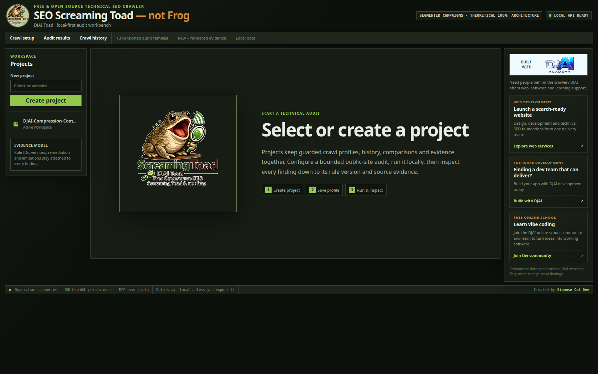
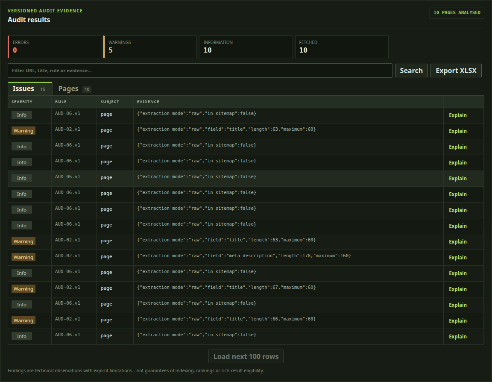
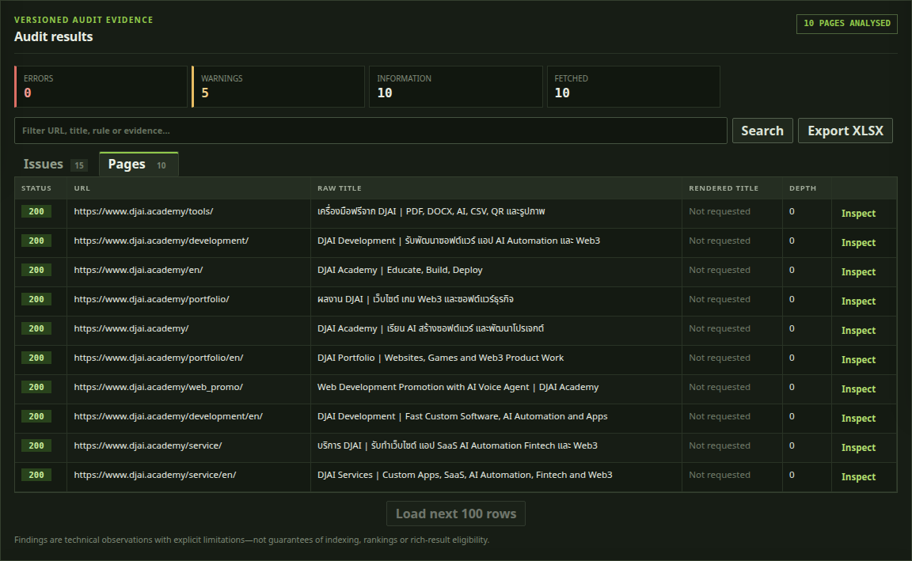
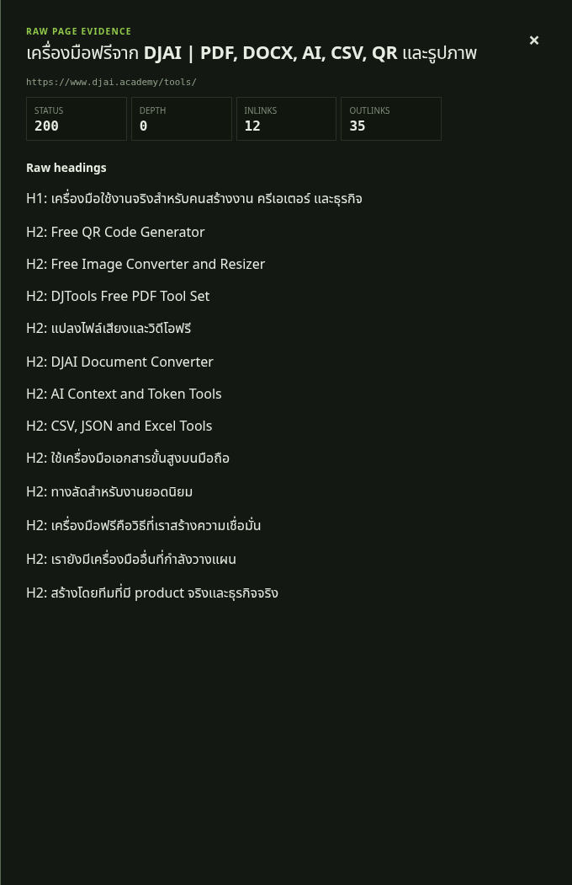
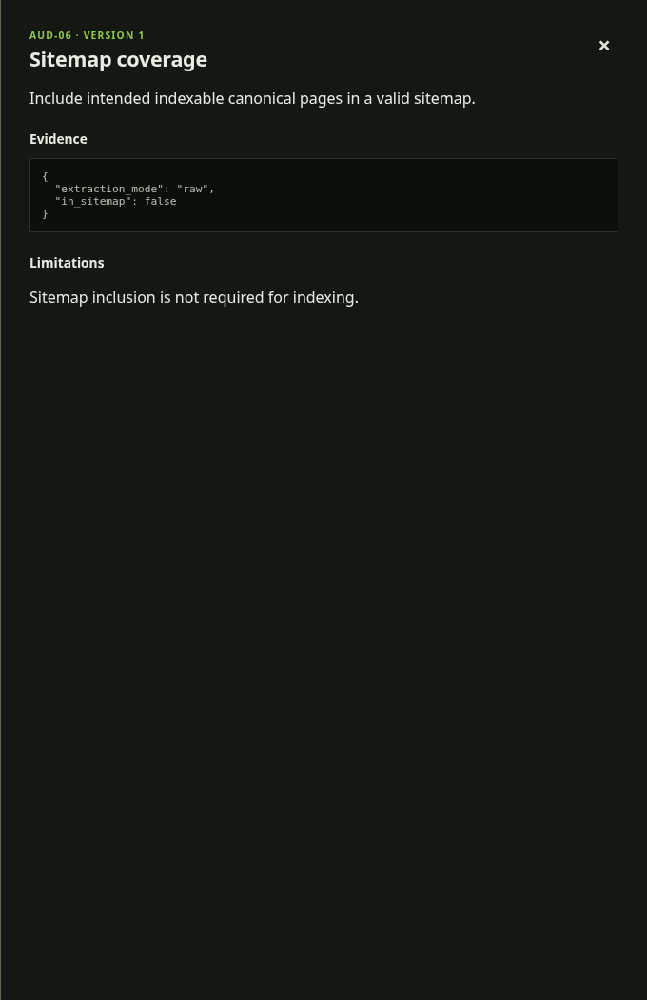
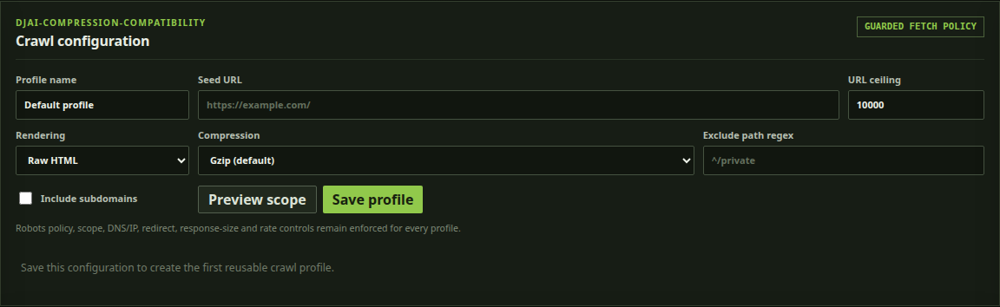
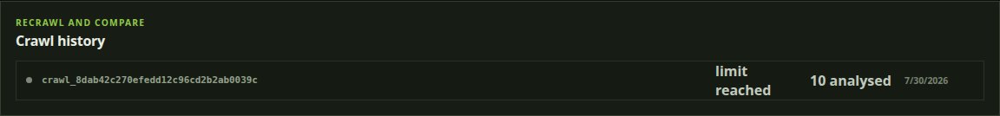

<div align="center">
  

# Free Open-Source SEO Screaming Toad — Not Frog

### A local-first Screaming Frog alternative with an MCP server and theoretical 100M+ URL campaign architecture

[](https://github.com/lovecatisgood-sudo/Free-Opensource-SEO-Screaming-Toad-not-Frog-tool-with-100million-url-crawl-potential/actions/workflows/ci.yml)
[](LICENSE)
[](go.mod)
[](docs/MCP.md)
[](docs/SECURITY_MODEL.md)
[](https://www.djai.academy/)

[Product tour](#see-the-dashboard) · [Quick start](#quick-start) · [MCP for AI agents](#mcp-server-for-ai-agents) · [SEO checks](#seo-audit-coverage) · [DJAI Academy](#built-with-the-djai-academy-community) · [Contributing](CONTRIBUTING.md)
</div>

SEO Screaming Toad, also called **DJAI Toad**, is a free, open-source technical SEO crawler and website audit tool. It crawls sites locally, preserves evidence in SQLite, audits raw and JavaScript-rendered pages, compares recrawls, exports reports, and exposes a guarded **Model Context Protocol (MCP) server** so AI agents can operate real SEO audits.

The product is co-created by **DJAI Academy trainers and community members**, with **[Siamese Cat Dev](https://github.com/lovecatisgood-sudo)** as its creator. It brings together practical SEO, product development, AI-agent workflows, and the DJAI community's build-in-public spirit.

If you are searching for an **open-source Screaming Frog alternative**, a self-hosted SEO spider, a Go website crawler, or an MCP-powered SEO audit tool, this project is built for that workflow—without uploading your crawl database to a hosted service.

> [!IMPORTANT]
> SEO Screaming Toad is an independent project and is not affiliated with or endorsed by Screaming Frog Ltd. “Screaming Frog” is used only for descriptive comparison; this project does not claim feature parity. The current project is a release candidate, so review the [project state](docs/PROJECT_STATE.md) before production use.

## Why SEO Screaming Toad?

| Capability | What you get |
|---|---|
| Open source | MIT-licensed Go crawler, React dashboard, CLI, local API, and MCP server |
| AI-agent operation | 23 bounded MCP tools for projects, crawls, evidence, comparisons, and reports |
| Evidence-backed audits | Versioned findings retain rule ID, severity, subject, evidence, and limitations |
| Raw + rendered analysis | Raw HTML stays distinct from optional JavaScript-rendered evidence |
| Local-first data | SQLite/WAL storage and managed exports remain on your machine |
| Safe crawling | Robots policy, DNS/IP guards, redirect validation, TLS verification, budgets, and scope controls |
| Recoverable jobs | Pause, resume, cancel, event timeline, checkpoints, and interrupted-run recovery |
| Large-site architecture | Segmented campaigns and durable frontiers designed toward theoretical 100M+ URL operation |

## See the dashboard

These are real screenshots from a local 10-page DJAI Academy verification crawl—not mockups or fabricated audit data.

<a href="docs/images/dashboard/01-dashboard-home.png"></a>

The dense desktop-style workbench keeps projects, bounded crawl profiles, audit evidence, recrawl history, and service links visible without turning a technical audit into a collection of disconnected screens.

<table>
  <tr>
    <td width="50%" valign="top">
      <a href="docs/images/dashboard/03-audit-findings.png"></a><br>
      <strong>Prioritized, evidence-backed findings.</strong> Filter issues by URL, title, rule, or evidence; see severity and versioned rule IDs; explain any finding; export an XLSX workbook.
    </td>
    <td width="50%" valign="top">
      <a href="docs/images/dashboard/04-page-inventory.png"></a><br>
      <strong>A crawl inventory experts can interrogate.</strong> Inspect status, URL, raw and rendered titles, crawl depth, and individual page evidence from one searchable table.
    </td>
  </tr>
  <tr>
    <td width="50%" valign="top">
      <a href="docs/images/dashboard/05-page-evidence.png"></a><br>
      <strong>Page-level proof.</strong> Move from a summary to status, depth, inlinks, outlinks, headings, raw extraction, rendered extraction, and raw-versus-rendered differences.
    </td>
    <td width="50%" valign="top">
      <a href="docs/images/dashboard/06-rule-explanation.png"></a><br>
      <strong>Rules that explain themselves.</strong> Every finding can expose remediation, structured JSON evidence, its rule version, and an explicit limitation to reduce blind fixes and false confidence.
    </td>
  </tr>
</table>

<a href="docs/images/dashboard/02-crawl-configuration.png"></a>

**Guarded, reusable crawl setup.** Define the seed, URL ceiling, raw or JavaScript-rendered mode, compression compatibility, subdomain scope, and path exclusions. Preview scope before starting; robots, DNS/IP, redirect, response-size, and rate controls remain enforced.

<details>
<summary><strong>More dashboard views: crawl history and DJAI services</strong></summary>

<p><a href="docs/images/dashboard/07-crawl-history.png"></a></p>
<p><strong>Recrawl and compare:</strong> preserve completed and interrupted history, then compare added, removed, changed, new, and fixed results between compatible runs.</p>

<p><a href="docs/images/dashboard/08-djai-services.png"></a></p>
<p><strong>Help is close to the tool:</strong> web development, software delivery, and the free DJAI learning community are available from a separate promotional rail that never changes audit findings.</p>
</details>

## Why experienced technical SEOs should evaluate Toad

SEO Screaming Toad is not merely a free crawler with a different mascot. It is built around workflows that matter when an audit must be repeatable, explainable, automatable, and safe:

- **Use the whole product without a paid crawler license.** The crawler, dashboard, CLI, local API, MCP server, reports, and source code are MIT licensed.
- **Give an AI agent purpose-built SEO tools—not a shell.** The 23-tool MCP interface covers bounded crawl setup, lifecycle control, pages, links, issues, explanations, comparisons, and managed exports.
- **Audit the evidence behind the recommendation.** Findings retain versioned rule identities, structured evidence, remediation, and limitations instead of presenting an unexplained score.
- **Keep raw and JavaScript-rendered SEO evidence distinct.** Diagnose client-side changes without silently replacing what the server originally returned.
- **Own the crawl data and automation path.** SQLite/WAL state remains local and can be operated through the UI, JSON CLI, authenticated loopback API, or MCP.
- **Recover instead of restarting blindly.** Durable frontiers, pause/resume/cancel controls, lifecycle events, and crawl history support long-running operational work.
- **Build beyond a single desktop crawl.** Segmented campaign primitives create a path toward theoretical 100M+ URL work while every individual crawl remains bounded.

If you already use Screaming Frog SEO Spider, test Toad on a representative authorized site and compare coverage, false positives, rendered output, exports, and the workflows your team actually depends on. Teams that value open code, first-class MCP automation, local evidence, and community-driven rules may find a compelling reason to switch; teams dependent on a mature commercial integration should validate that dependency before migrating.

## Quick start

Requirements: Go version from [`.go-version`](.go-version). Node and pnpm are needed only for rendered mode or frontend development.

```bash
git clone https://github.com/lovecatisgood-sudo/Free-Opensource-SEO-Screaming-Toad-not-Frog-tool-with-100million-url-crawl-potential.git
cd Free-Opensource-SEO-Screaming-Toad-not-Frog-tool-with-100million-url-crawl-potential
make bootstrap
go run ./cmd/seo-auditor
```

Open [http://127.0.0.1:7331](http://127.0.0.1:7331), create a project and crawl profile, preview its scope, and start an authorized public-site audit.

For a sandboxed development environment:

```bash
docker compose up -d dev
docker compose exec dev bash
make test
```

See [DEVELOPMENT.md](DEVELOPMENT.md) for container boundaries and the host-toolchain path. Only crawl websites you own or are authorized to test.

## MCP server for AI agents

SEO Screaming Toad includes `seo-auditor-mcp`, a stdio MCP server built with the official Go SDK. An MCP-compatible AI agent can create bounded profiles, preview scope, start or control crawls, inspect SEO issues and page evidence, compare runs, and export managed reports.

```text
AI agent / MCP client
        │ stdio
        ▼
seo-auditor-mcp
        │ authenticated loopback API
        ▼
SEO Screaming Toad → guarded crawler → SQLite evidence
```

Build the two executables:

```bash
mkdir -p bin
go build -o bin/seo-auditor ./cmd/seo-auditor
go build -o bin/seo-auditor-mcp ./cmd/seo-auditor-mcp
```

Start `bin/seo-auditor`, configure your MCP client to run the absolute path to `bin/seo-auditor-mcp`, and call `health_get`. A connected result reports `api_connected: true`.

The MCP interface deliberately exposes no generic shell, arbitrary filesystem access, SQL execution, or unrestricted HTTP fetch. Read the complete [MCP setup and tool guide](docs/MCP.md) or copy the [generic MCP client configuration](examples/mcp-client.json).

## SEO audit coverage

The versioned audit engine currently covers:

- HTTP failures, redirects, and broken internal targets;
- titles, meta descriptions, headings, and duplicate metadata;
- canonical tags, canonical chains, conflicts, and invalid targets;
- indexability, robots directives, robots.txt, and sitemap coverage;
- exact and near-duplicate content signals;
- hreflang validity, targets, and reciprocity;
- image alt attributes and failing image resources;
- crawl depth, orphan-like pages, internal links, and nofollow observations;
- mixed content and selected defensive headers;
- JSON-LD structured-data syntax and basic shape validation;
- raw-versus-rendered SEO differences for JavaScript sites.

Every check documents its limitations. Findings are technical observations—not promises about indexing, rankings, traffic, or rich-result eligibility. See the [audit rule catalog](docs/RULE_CATALOG.md).

## Technical crawler features

- Concurrent Go crawl engine with per-host politeness and bounded retries
- Robots.txt enforcement and sitemap discovery
- URL normalization, deduplication, query controls, and crawler-trap protection
- Prohibited-network and mixed-DNS-answer rejection for SSRF resistance
- Approved-address connection pinning with normal TLS hostname verification
- Response size, header, timeout, redirect, depth, and URL ceilings
- SQLite/WAL durable frontier with serialized writes and recovery
- Optional isolated TypeScript/Chromium rendering worker
- Dense technical React dashboard inspired by desktop SEO crawlers
- Local authenticated API, JSON CLI, MCP server, CSV, NDJSON, and XLSX reports
- Crawl-to-crawl comparison for added, removed, changed, new, and fixed results

## About the 100M+ URL architecture

The system has segmented-campaign and distributed-coordination prototypes intended to process bounded batches repeatedly instead of holding an entire enormous crawl in memory. Local synthetic persistence/analysis campaigns have completed at 1 million and 5 million URLs, and a 100,000-URL single-crawl gate has passed.

**100M+ is a theoretical architectural potential—not a verified live-network capacity, benchmark, support promise, or guarantee.** Actual scale depends on hardware, storage, site behavior, politeness settings, rendering, network conditions, and operational design. Read the [scale strategy](docs/SCALE_STRATEGY.md) and [benchmark evidence](docs/benchmarks/2026-07-30-segmented-campaign.md).

## Built with the DJAI Academy community

SEO Screaming Toad is a collaborative open-source product created by **[Siamese Cat Dev](https://github.com/lovecatisgood-sudo)** together with **DJAI Academy trainers and community members**. DJAI is where learners, builders, trainers, and working developers turn AI-assisted ideas into useful software—and this crawler is one result of that community working together.

- **Looking for web development?** [Launch a search-ready website with DJAI](https://www.djai.academy/web_promo/?lang=en)—from design and implementation to technical SEO foundations.
- **Finding a development team that can deliver?** [Explore DJAI's software development portfolio](https://www.djai.academy/portfolio/en/) and build your app, automation, platform, or custom software with the team.
- **Want to learn vibe coding?** [Join the free DJAI online school community](https://school.djai.academy/) and learn alongside people turning ideas into working products.
- **Need a break from debugging?** Visit [Siamese Cat Cafe](https://siamesecat.cafe/) in Bangna, Bangkok and meet its **16 rescued and adopted cats** over a drink.

The service and community links are promotional and open external sites. They never influence crawl results, issue severity, evidence, or recommendations.

## Project structure

```text
cmd/                    Go application, CLI, MCP, SBOM, and scale commands
internal/crawler/       crawl engine, robots, sitemaps, links, and traps
internal/fetchpolicy/   target safety, transport, redirects, and scope
internal/rules/         versioned technical SEO audit rules
internal/database/      SQLite/WAL persistence, frontier, and recovery
internal/mcpserver/     bounded Model Context Protocol tools
web/app/                React technical audit dashboard
web/renderer/           isolated optional JavaScript renderer
docs/                   PRD, architecture, operations, security, and evidence
```

## Contributing

Bug reports, new SEO rules, UX improvements, platform testing, documentation, and thoughtful performance work are welcome. Start with [CONTRIBUTING.md](CONTRIBUTING.md), review the [security model](docs/SECURITY_MODEL.md), and choose an issue that matches your experience.

Please give the repository a ⭐ if an open-source, MCP-enabled SEO crawler is useful to you. Stars help more SEO practitioners and AI builders discover the project.

## Security and responsible use

Do not put vulnerabilities, private URLs, credentials, or raw client crawl data in public issues. Follow [SECURITY.md](SECURITY.md) for responsible disclosure. The crawler must only be used against systems you are authorized to audit.

## License and credits

Released under the [MIT License](LICENSE). Third-party dependency and source notices are recorded in [THIRD_PARTY_NOTICES.md](THIRD_PARTY_NOTICES.md).

Created by **[Siamese Cat Dev](https://github.com/lovecatisgood-sudo)**, co-created with trainers and community members from **[DJAI Academy](https://www.djai.academy/)**.
